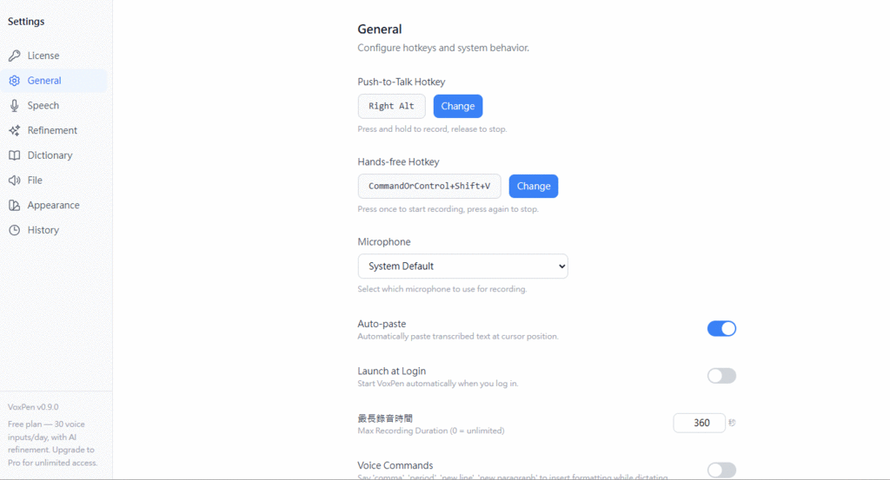
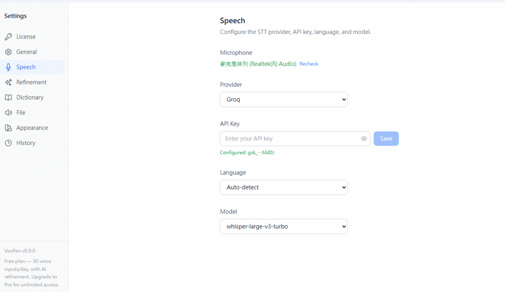
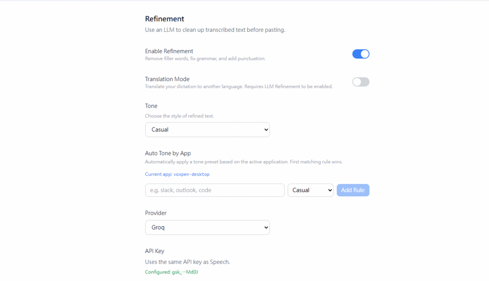
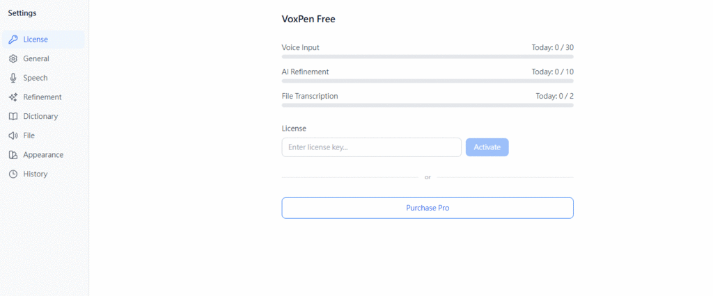

# VoxPen Desktop (語墨桌面版)

[繁體中文](./README.zh-TW.md) | [Website](https://voxpen.app/)

System-tray voice-to-text app for Windows and Linux. Press a global hotkey to dictate, and the transcribed + refined text is automatically pasted at the cursor position in any app.

Built with **Tauri v2** (Rust backend + React frontend), BYOK (Bring Your Own Key).

## Screenshots

| General Settings | Speech Settings |
|:---:|:---:|
|  |  |

| Refinement Settings | License & Usage |
|:---:|:---:|
|  |  |

<p align="center">
  
  <br><em>Floating recording indicator</em>
</p>

## Features

- **Global hotkey** — works system-wide in any app, no input method switching
- **Hold-to-dictate** or **toggle** recording mode
- **STT providers** — Groq Whisper, OpenAI Whisper, or custom endpoint
- **LLM refinement** — auto-remove filler words, fix grammar, add punctuation
- **Auto-paste** — transcription goes straight to cursor position
- **Translation mode** — translate speech to a target language
- **Multi-language** — Auto-detect, 中文, English, 日本語
- **Floating overlay** — recording/processing status indicator
- **Transcription history** — searchable SQLite database
- **No telemetry** — your API keys stay local (encrypted storage)

## Download

Download the latest release from [Releases](https://github.com/soanseng/voxpen-desktop/releases).

| Platform | File | Notes |
|----------|------|-------|
| **Windows x64** | `.exe` (NSIS installer) | No admin required |
| **Linux x64** | `.AppImage` / `.deb` | AppImage works on most distros |
| **Linux x64 (Arch)** | `voxpen-desktop` (native binary) | For Arch Linux / rolling-release distros |

> **Windows**: Not code-signed. Click "More info" → "Run anyway" if SmartScreen blocks it.

### Wayland Auto-Paste

On Wayland sessions, VoxPen uses [`wtype`](https://github.com/atx/wtype) to simulate Ctrl+V for auto-paste. Install it for your distro:

| Distro | Command |
|--------|---------|
| **Arch / Manjaro** | `sudo pacman -S wtype` |
| **Debian / Ubuntu 24.04+** | `sudo apt install wtype` |
| **Fedora** | `sudo dnf install wtype` |

> On X11, `wtype` is not needed — VoxPen uses `enigo` (libxdo) directly.

### Arch Linux / Rolling-Release Distros

The AppImage bundles Ubuntu's WebKit libraries which may be ABI-incompatible with newer system libraries (e.g. on Arch, Fedora Rawhide). Use the native binary instead:

1. Install system dependencies:
   ```bash
   sudo pacman -S webkit2gtk-4.1 libayatana-appindicator wtype
   ```
2. Download `voxpen-desktop` from the [latest release](https://github.com/soanseng/voxpen-desktop/releases)
3. Make it executable and place it in your PATH:
   ```bash
   chmod +x voxpen-desktop
   cp voxpen-desktop ~/.local/bin/voxpen
   ```

### Debian / Ubuntu

1. Download the `.deb` or `.AppImage` from the [latest release](https://github.com/soanseng/voxpen-desktop/releases)
2. For Wayland auto-paste support (Ubuntu 24.04+):
   ```bash
   sudo apt install wtype
   ```
   > On older Debian/Ubuntu versions, `wtype` may not be in the official repos. Build from [source](https://github.com/atx/wtype) or use X11 where `enigo` works natively.

## Licensing

VoxPen Desktop uses a freemium model with [LemonSqueezy](https://www.lemonsqueezy.com/) license keys.

- **Free tier** — limited daily usage
- **Pro tier** — unlimited usage with a license key

You can purchase a license key from the app's settings page. Enter the key in **Settings → License** to activate Pro features. The source code is fully open — you are free to build and modify the app yourself.

## Build from Source

### Prerequisites

- [Node.js](https://nodejs.org/) (LTS)
- [pnpm](https://pnpm.io/)
- [Rust](https://rustup.rs/) (stable)
- Linux (Debian/Ubuntu): `libwebkit2gtk-4.1-dev libgtk-3-dev libappindicator3-dev librsvg2-dev libasound2-dev libxdo-dev patchelf`
- Linux (Arch): `webkit2gtk-4.1 libayatana-appindicator`

### Steps

```bash
git clone https://github.com/soanseng/voxpen-desktop.git
cd voxpen-desktop
pnpm install
cargo tauri dev          # development
cargo tauri build        # production build
```

## Contributing

Pull requests are welcome!

### macOS Build — Help Wanted

macOS builds are **not currently available** because the CI environment lacks code signing and notarization setup. If you have experience with:

- Apple Developer code signing in GitHub Actions
- Tauri macOS DMG builds and notarization
- Universal binary builds (x86_64 + aarch64)

Please consider contributing a PR to add macOS support to the release workflow. The build matrix entry is already prepared — it just needs signing configuration. See `.github/workflows/release.yml`.

### Development

```bash
# Run tests
cargo test --manifest-path src-tauri/Cargo.toml

# Lint
cargo clippy --manifest-path src-tauri/Cargo.toml -- -D warnings

# Frontend
pnpm dev
pnpm build
```

## License

MIT
